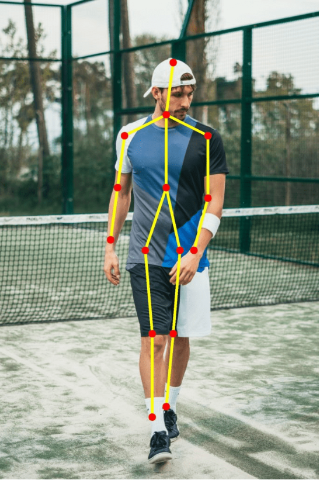
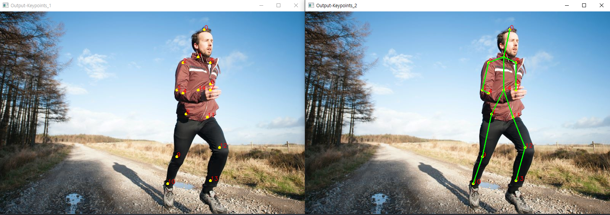
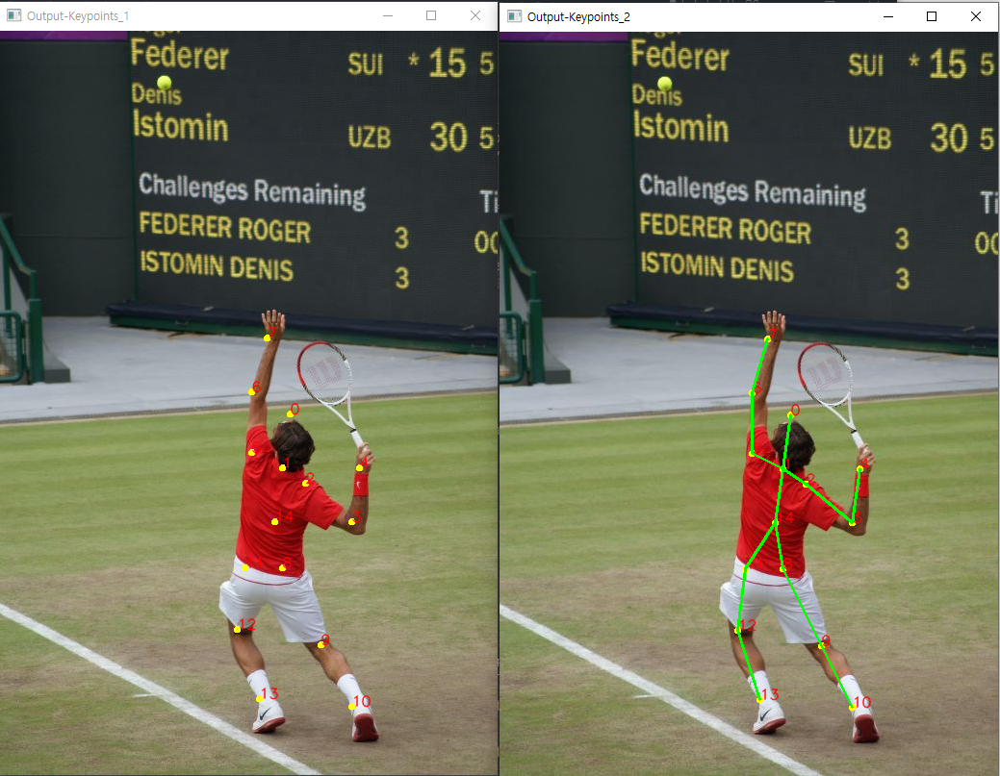

# OpenPose 실습 예제

openpose를 활용하여 사진 속 인물의 자세를 추정하는 실습을 한 내용입니다.


## OpenPose란?

OpenPose는 단일 이미지에서 인체, 손, 얼굴 및 발 키포인트 를 공동으로 감지하는 최초의 실시간 다중 사람 시스템을 나타 냅니다.

### 결과



### 특징

#### 주요 기능 :

    2D 실시간 다중 사람 키포인트 감지 : 6개의 발 키포인트를 포함하여 15, 18 또는 25 키포인트의 신체/발 키포인트 추정

#### 입력

이미지, 비디오, 웹캠, IP 카메라 및 사용자 지정 입력 소스

#### 출력

기본 이미지 : 키포인트 표시/저장


## 실습하기

#### 0. 프로젝트 다운받기

해당 프로젝트를 `git pull`또는 zip으로 다운받아 원하는 위치에 저장 합니다.


#### 1. 모델 다운 받기

[OpenPose Github](https://github.com/CMU-Perceptual-Computing-Lab/openpose)해당 깃허브에서 OpenPose를 프로젝트 밑으로 다운받아 옵니다.

`openpose -> models -> getModels.bat`을 실행하여 모델을 다운 받습니다.


#### 2. 라이브러리 다운 받기

프로젝트에서 터미널을 실행하여 가상환경 혹은 전역에 필요한 라이브러리를 다운 받습니다.

```textile
# 가상환경 설치
$python -m venv venv
# 가상환경 실행
$source venv/Scripts/activate
# 라이브러리 다운
$pip install -r requirement.txt


# 전역에 다운받는 사람은 라이브러리 다운 문구만 실행해주면 됩니다.
```


#### 3. 결과 확인

작업 환경을 `openpose_body`로 옮겨준 뒤 `openpose.py`를 실행합니다.

##### 3 - 1 결과



    2개의 사진이 차례로 나오면 성공 입니다.


#### 4. 활용

`openpose_body`폴더안의 `image`에 OpenPose가 잘 적용되는 이미지들이 있습니다.

`openpose.py`를 열면

```python
# 이미지 읽어오기
image = cv2.imread("image//running.jpg")
```

해당하는 부분이 이미지를 읽어오는 코드로 running.jpg를 다른 이름으로 바꿔주면 다른 이미지의 openpose결과를 출력 할 수 있습니다.

##### 4 - 1 결과



`tennis.jpg`로 적용한 예시입니다.


